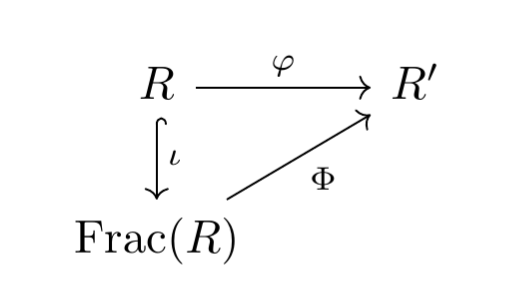

## 1. Introduction

This article is to test the mathematical article's compilation, and other functions. Now, allow me to quote:

> The world is material; matter is in motion; motion follows laws; and these laws can be understood.

## 2. Math

__Prop__ Given a functor \alpha: I \to Set, let  X = \bigsqcup_i \alpha(i) , define:


a \to b \Leftrightarrow (a, b) \in R \Leftrightarrow b = \alpha(\sigma)(a)


_Proof_

The following diagram says it all:



### 2.1. What about a title containing \pi

 \alpha  is an ordinal if it is a transitive set and is well-ordered with respect to \in.

## 3. Functions

### 3.1. Download link

[article](article1.pdf)

### 3.2. Columns

```html
{} <!-- begin columns block -->

## x1 Column
Lorem markdownum insigne...

<---> <!-- magic separator, between columns -->

## x2 Column
Lorem markdownum insigne...

{}
```

{}
### x1 Column
Lorem markdownum insigne. Olympo signis Delphis! Retexi Nereius nova develat
stringit, frustra Saturnius uteroque inter! Oculis non ritibus Telethusa
protulit, sed sed aere valvis inhaesuro Pallas animam: qui _quid_, ignes.
Miseratus fonte Ditis conubia.

<--->

### x2 Column
Lorem markdownum insigne. Olympo signis Delphis! Retexi Nereius nova develat
stringit, frustra Saturnius uteroque inter!

Lorem markdownum insigne. Olympo signis Delphis! Retexi Nereius nova develat
stringit, frustra Saturnius uteroque inter! Oculis non ritibus Telethusa
protulit, sed sed aere valvis inhaesuro Pallas animam: qui _quid_, ignes.
Miseratus fonte Ditis conubia.

{}

## 3.3. Fold

```tpl
{}
## Markdown content
Lorem markdownum insigne...
{}
```
{}
### Markdown content
Lorem markdownum insigne...
{}

## 3.4. Hints

```tpl
{}
**Markdown content**  
Lorem markdownum insigne. Olympo signis Delphis! Retexi Nereius nova develat
stringit, frustra Saturnius uteroque inter! Oculis non ritibus Telethusa
{}
```

{}
**Markdown content** 
Lorem markdownum insigne. Olympo signis Delphis! Retexi Nereius nova develat
stringit, frustra Saturnius uteroque inter! Oculis non ritibus Telethusa
{}
