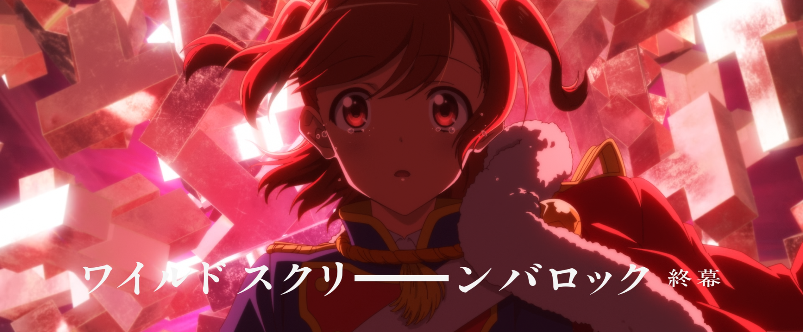

铜管与弦的轰鸣，仿佛宇宙诞生。华恋睁开双眼，世界开始呈现。巨响退去，取而代之的是尘埃，雨滴，微风..... 色彩开始流动，事件开始发生，故事开始编码。这是少女歌剧剧场版的开头第一秒，背景音乐名叫 Color Temperature。最近补完了少女歌剧的TV版和剧场版，这部剧的美术设计和音乐堪称顶级。在经历了精神的震颤后，我急切地想尝试凭借自己的贫瘠的认识写点什么，即便我知道这部剧一定有某种哲学或艺术理论的背景，而且我依然有许多不明白的地方。

一切都从这里开始。

## 1. 神秘剧场和长颈鹿

神秘剧场最初是少女们进行“选拔”的场所。少女们比试的并非成绩，演技等硬实力；而是“闪耀”。所谓闪耀，我觉得可以说成是“真实欲望与被言说的欲望的接近程度”。

如何理解这个定义？举个例子，如果你问读高中的我，读书的意义是什么，我可能会从彩虹六号里抬起头抛出一句“考个好大学”，然而我现在只想下一把多拿几个人头，所以我的闪耀只能有0.00114。如果你问我们班第一名同样的问题，他可能会说“为了有一天能让穷苦人民过上好日子”，那他的闪耀会是0.98765。

长颈鹿为这一比试讲解了规则：(1)切掉对手的纽扣就算胜利（闪耀值高者获胜），(2)最终胜者可以去往任何舞台。仅此而已。实际上闪耀程度直接决定了胜负。后来小光才发现败者将会失去她们的闪耀——欲望的归零（有时候会归零得不彻底，还残留一些被言说的欲望，比如小光和华恋都记得她们儿时的承诺）。所以第三个规则是：(3)败者的闪耀会被用来塑造胜者期望的舞台。

然而，规则并非僵死的。长颈鹿所言“去往任何舞台”这一规则就包含了其自我进化和自我毁灭的可能。考虑一个极端的情况，如果我想去往的是“不存在可以把任何人送往某个舞台的权威”的舞台，这是否就会导致规则的自我阉割？因为在那里无人有力将任何人送往任何舞台。还有，“无法预测的舞台”或许指的就是“在一定规则下运作，但依然可以打破规则，建立新规则的舞台”（要知道“没有规则的舞台”是不可能的，因为“没有规则”本身也是规则）。在大香蕉在结束轮回之日说出想要去到“无法预测的舞台”后，所有旧时的舞台规则还照样存在。但在小光说出“无法预测的舞台”后，12集末尾，舞台规则解体了：掉落的金色纽扣不再意味着失败，小光和华恋的闪耀也没有消失。长颈鹿在一旁喝彩：“这就是我想要的舞台！！我懂的！！！”

至此，我觉得神秘剧场可以解释为一个包含了内在秩序的场所，它吸引人们进入，参与它的游戏。秩序是约定俗成的，且被大多数人所遵守。秩序的首要规定是“未来所有的秩序都是可能的”，因此它自己就始终包含着进化和自我瓦解的力量，先知先觉者有可能修改游戏规则。

少歌里的神秘剧场比试的是“闪耀”，而现实里的剧场显然是无法比较这个东西的。现实里是否有这样的神秘剧场？我觉得很多。这里举个不算危险的例子。“你给女朋友买的东西越贵，就证明你越爱她”这一规则，似乎是约定俗成的，主宰了大部分逛商场的男女，也在吸引新的情侣进入这一游戏。他们会通过攀比购买贵的东西来获取伴侣和其他人的认同。直到有人意识到这一规则是荒唐的，或选择退出或选择批判。也有人会促使规则的升级，使其成为“你给女朋友买的东西属于这几个品牌，证明你越有品味；你给女朋友买的东西越贵，就证明你越爱她”。

至于长颈鹿，我觉得它是代表的就是神秘剧场的秩序，它无法依靠自身的力量改变，而必须借助剧场中演员的行动。

## 2. 华恋和小光

华恋参加选拔的唯一理由就是“和小光一同演绎starlight”，毫无疑问，这个理由和她的欲望是如此接近，所以顺理成章地进入了终极对决。小光最初参加选拔时和华恋是一样的情况。但两人都失败了。华恋失败的原因，即真实欲望与言说欲望的那0.00001的不一致性，我觉得可以在剧场版结尾看到。

蓝色的灯柱筑起狭长的灯墙，漂浮的海蓝色水晶肆意地折射着舞台的光。灯墙的一端是重生的华恋，她开始诉说自己的内心，“小光很美，却很可怕。小光如此害怕，我却又很羡慕她”。蓝色，是小光眼睛的颜色，是小光金色纽扣下的披风的颜色，是小光刀上镶嵌的宝石的颜色，就像是小光生命的一部分。“小光令我如此不甘，目光无法从小光离开”，她想，“我明白了，我为什么会站在舞台上——我一定要说这最后的台词”，华恋的剑破碎，折断。“用你的闪耀贯穿我啊”，蓝色披风的人说，这里是她的主场。华恋挥舞断裂的剑，但回过神来发现小光的刀已经刺入她的胸膛，她和小光的额头紧贴在一起。为什么小光的眼神如此坚定。华恋说出了最后的台词——“我也不想输给小光”。

小光的第一次失败，或许和华恋极为类似，也即那0.00001的不一致性。在第二次尝试的开始，小光的目的也只是想通过选拔的胜利找回曾经失去的闪耀。但自从华恋乱入后，她又不得不改变策略，见识到舞台规则的残暴和邪恶的她，做到了当前规则下的极限——仅靠她自身的闪耀来驱动自己想要的舞台，一个无法预测的舞台，从而保护华恋和其他舞台少女的闪耀不被剥夺。而她自己则陷入一个无尽且空洞的摘星剧场中，不断重复相同的台词和动作。小光和华恋的故事和stsrlight的故事惊人地重合（然而华恋的闪耀还是被剥夺了，为什么呢？我也解释不了）。

## 3. 再生

剧中反复出现了“再生产”这一哲学术语，但我对这个词没有任何认识。所以只能退一步写点我懂的——再生。

闪耀是可以再生的，第8集中小光经历了闪耀的重造；第12集，华恋站在倒塌的东京塔上说“就算被夺走也不会结束，失去的闪耀也不会消失”。舞台是可以再生的，说的就是舞台规则的更新迭代。

舞台少女是会再生的。正如长颈鹿所说，舞台少女太过于迷人，以至于剧本必须要写下去（让这个IP继续赚钱，所以才有了剧场版）。在剧场版中，大部分舞台少女被填入新的欲望：或去往剧团或去往大学，寻找新的舞台。除了志愿单空白的华恋和缺席的小光。

大香蕉是清醒的，相比于不知情的舞台少女，她知道自己被灌注了新的欲望。有一个她绝对无法对抗的，且只能绝对服从的存在——屏幕外的我们（但我们真的是自由的吗？），要让所有舞台少女承担永远表演下去的命运。她痛苦地接受了，不过也在不断地拷问身边的人：“列车终会到站，那么舞台呢，我们呢”？对啊，要是我们到不了怎么办，动画还会有续集吗？要是我们到达了怎么办，你们怎么就认识不到我们作为舞台少女会永远表演下去的悲惨命运？

华恋最终清醒了。在TV版结束时，华恋如愿与小光一同完成了starlight，她作为一个动画角色的使命已经完成。而在剧场版中，她没有被赋予任何欲望和动机，成了一具空虚的，毫无意义的空壳。她望向屏幕外的我们，发现了自己只要存在，便是个剧中的人。她焦急地追问小光，“怎么办，starlight演完之后呢”？小光说她要继续演下去。华恋绝望地说：“我什么都没有了”。番茄爆裂飞溅，华恋迎来了她的死亡。

小光是清醒的。她从剧场版一开始就在寻找华恋，之后，她在云层上方的铁轨上遇到了长颈鹿。它让她窥见了舞台少女永远也无法对抗的悲剧命运——你们被生产出来就是为了满足观众的需要；你们存在的意义就是被观看，被评价；你们将会永远地表演下去；而我，长颈鹿，是这个舞台的燃料，没有我（秩序），就没有你们过去的舞台。它化作瓜果蔬菜拼接而成的模样，从中掉落出一个番茄。终于，正如一切恒星的衰老，膨胀和爆发，长颈鹿开始在烈焰中燃烧，随后它从高空一跃而下。

华恋迎来了她的重生，在说出了最后一句台词后，她热泪盈眶（我泪流满面），红色的position 0的T型金属块从她的心脏中喷涌而出。东京塔被拦腰爆破，纷飞的position 0就像礼炮的彩纸。东京塔的上半部分如同火箭一样升上天空，随后倒转，头朝地栽进一个巨大的position 0的中央。“revue starlight的引擎停下了”，她说。

至此，旧舞台彻底停止，所有角色都已再生，准备前往下一个舞台。

## 4. 结语

趁着观影后的热情，本着能写多少写多少的心态，我把这篇感想写出来了。可能有诸多观点看起来很幼稚，我明白的。我也明白问题的答案尽在书本中。最后，我想说，少歌真的是一部杰出的作品。棕色短发可爱系 x 黑色长发高冷系是世界第一的CP模式。​​​​
